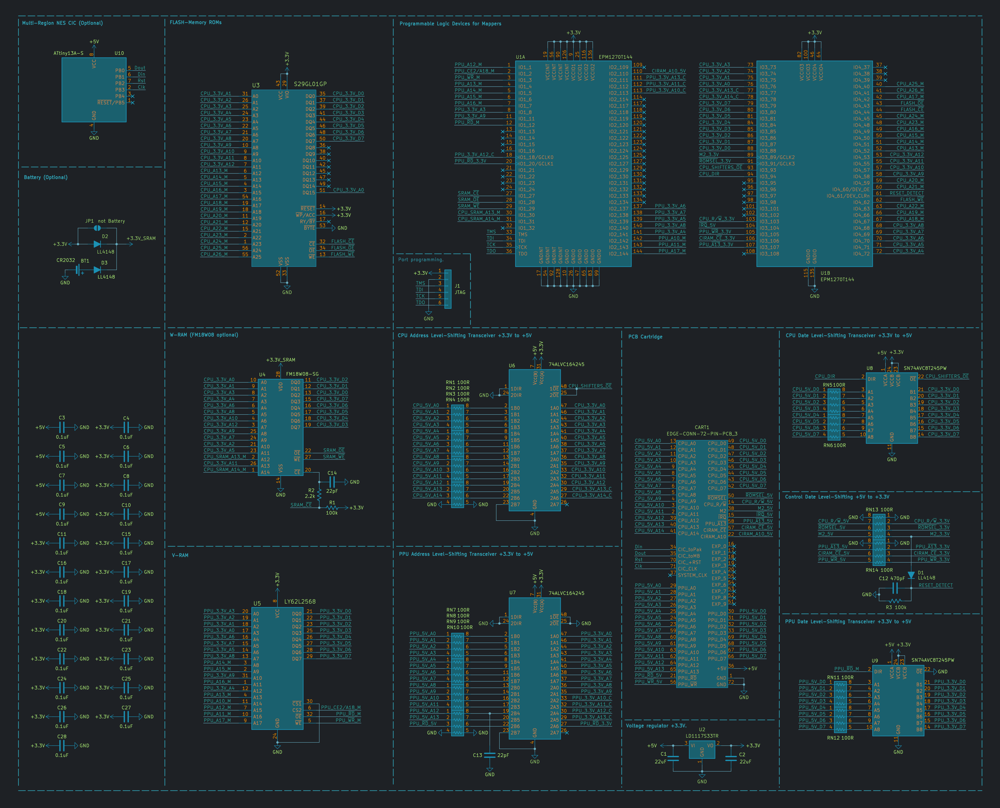
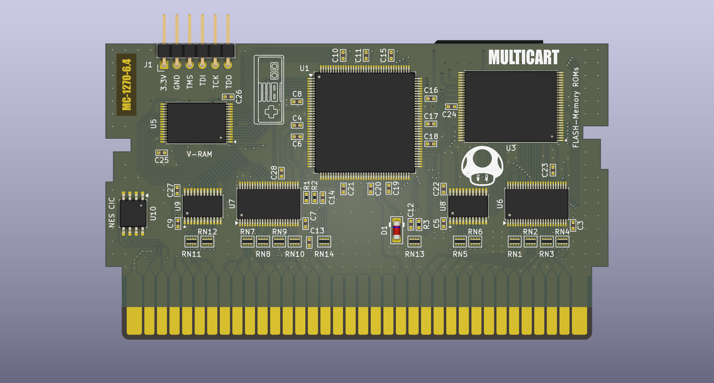
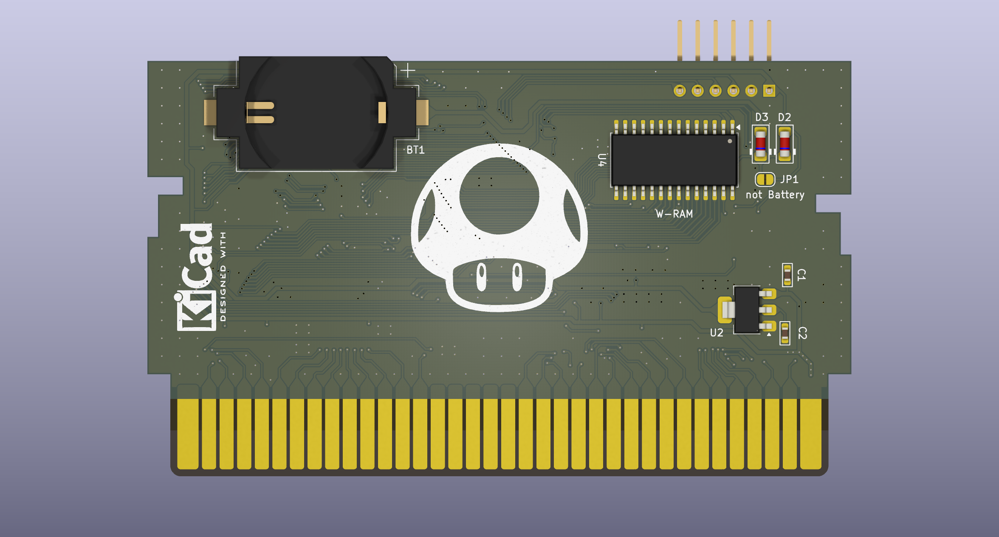
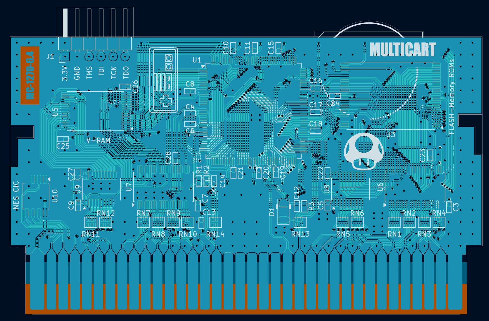
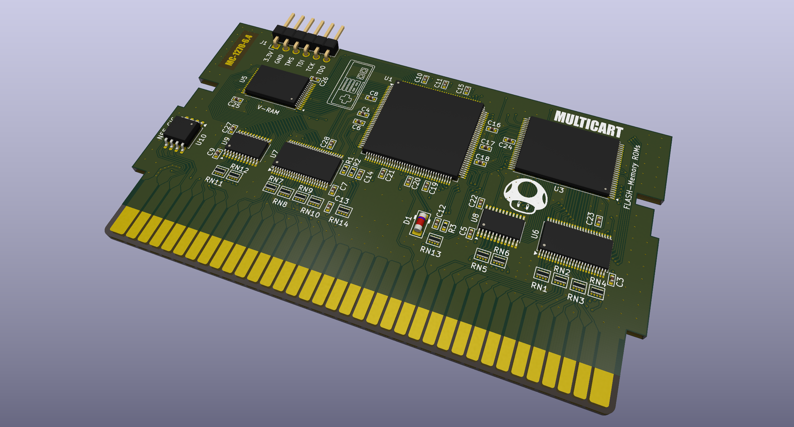

# 🎮 COOLGIRL - Ultimate Multigame Cartridge for Nintendo Entertainment System

The goal of this project is to create a Nintendo Entertainment System (NES) cartridge in KiCad based on the [coolgirl-famicom-multicart](https://github.com/ClusterM/coolgirl-famicom-multicart) project. This hardware design remains functionally identical to ClusterM's original project and can support up to ~700 games across various mappers.

### 🛠️ Architecture Overview
* **🧠 CPLD Core**: Uses the EPM1270T144 chip to emulate various mappers.
* **💾 Memory Layout**: PRG and CHR data share a single flash memory chip.
* **⚡ Boot Sequence**: The bootloader copies CHR data from Flash to CHR-RAM before game launch.
* **⚙️ Configuration**: Registers manage PRG offsets, bank modes, and mapper IDs.
* **🔒 Security**: Features a dedicated write-protection lock bit to secure settings after configuration.

## 📋 Full Characteristics
* **PRG ROM**: Up to 128 MiB
* **CHR RAM**: Up to 512 KiB
* **PRG RAM**: 32 KiB, non-volatile (FRAM) (optional)

---

## 🚀 How to Build

### 🔌 Hardware

#### 📄 Bill of Materials
* 🛒 [BoM](Coolgirl-NES_Rev6.x/production/bom.csv)

#### 🗺️ Schematic

* The [kicad_sch](Coolgirl-NES_Rev6.x/Coolgirl-NES_Rev6.x.kicad_sch) file can be opened using [KiCad](https://kicad.org).
 
#### 🎛️ PCB Design
The board is designed for ordering on [jlcpcb.com](https://jlcpcb.com).

| 🟢 3D Render (Top) | 🔵 3D Render (Bottom) |
| :---: | :---: |
|  |  |

* **Layers**: 2
* **PCB Thickness**: 1.2mm
* **Edge Connectors**: Gold fingers are highly recommended

* 📂 Layout source: [kicad_pcb](Coolgirl-NES_Rev6.x/Coolgirl-NES_Rev6.x.kicad_pcb) can be opened using [KiCad](https://kicad.org).
* 📦 Production files: Generated gerbers are located in the [Coolgirl-NES_Rev6.x/production](Coolgirl-NES_Rev6.x/production) directory.

### 💾 Firmware
All firmware and register descriptions are sourced from the [coolgirl-famicom-multicart](https://github.com/ClusterM/coolgirl-famicom-multicart/tree/master) project, corresponding to the board revision.

EPM1270T144 CPLD firmware can be compiled using the [Quartus Prime Lite 21.1](https://www.altera.com/downloads/fpga-development-tools/quartus-prime-lite-edition-design-software-version-21-1-windows). Open [CoolGirl.qpf](https://github.com/ClusterM/coolgirl-famicom-multicart/blob/master/CoolGirl_rev6.x/CoolGirl.qpf) to configure and compile project.

All mappers can't fit into the CPLD at once, so you need to select required mappers in [config file](https://github.com/ClusterM/coolgirl-famicom-multicart/blob/master/CoolGirl_config.vh), so they can fit into 1270 macrocells. Also, you can set `RESET_COMBINATION` parameter to specify software reset button combination, it works on original consoles and some famiclones. Default combination is `8'b11010010` (Left+Start+A+B). Set it to 0 to disable and free some macrocells.

There are JTAG pads on the cartridge board to connect programmer (USB Blaster).

### 💿 ROM Preparing
You can use my [COOLGIRL Multirom Builder based on ca65](https://github.com/viuhimciuc/coolgirl-multirom-builder-ca65)

and also use from [COOLGIRL Multirom Builder](https://github.com/ClusterM/coolgirl-multirom-builder)

to combine multiple ROMs into one with menu and loader. ROM can be written to assembled cartridge using [Famicom/NES Dumper/Writer](https://github.com/ClusterM/famicom-dumper-writer). Non-soldered flash memory chip can be written using programmer.
